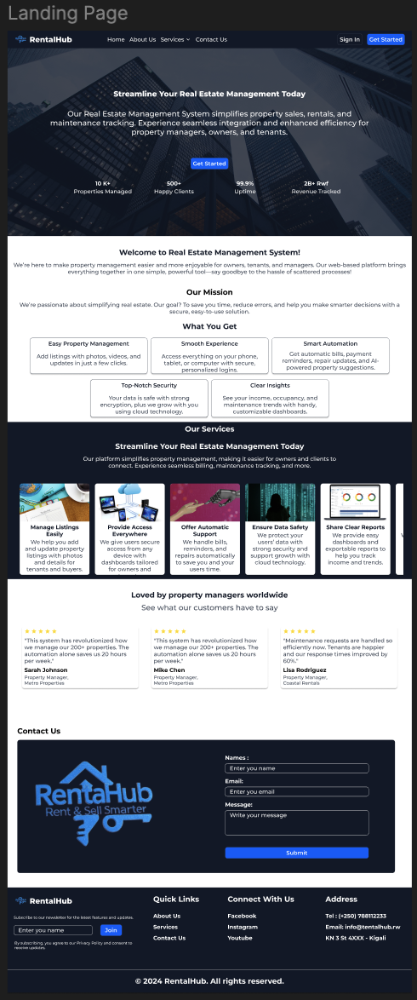

# 🏠 RentalHub Management System

## 📌 Overview

The **RentalHub Management System (RMS)** is a **web-based solution** designed to streamline property sales, rentals, billing, repair tracking, and client-owner interactions. The system integrates **property management, client handling, financial automation, and analytics** into a unified platform with a strong emphasis on **security, scalability, and user experience**.

This project aims to solve inefficiencies in traditional rentalHub management systems by providing a **modern, secure, and scalable platform** suitable for property managers, owners, tenants, and maintenance teams.

---

## 🚀 Features

### Core Functionalities

* **Property Management** – List, update, and track properties for sale or rent with photos, videos, and virtual tours.
* **Owner & Client Management** – Store profiles, preferences, transaction history, and feedback ratings.
* **Automated Billing** – Generate invoices, send reminders (email/SMS), and support multiple payment methods.
* **Repair & Maintenance Tracking** – Record requests, assign tasks, estimate costs, and track completion.
* **Financial Reporting** – Exportable reports (PDF, CSV, Excel) with real-time insights and currency conversion.
* **User Roles & Permissions** – Admin, Owner, Tenant, and Maintenance with **Role-Based Access Control (RBAC)**.
* **Responsive UI** – Mobile-first design with accessibility (dark mode, screen reader support, voice commands).
* **Mobile APP** - A mobile app with Flutter 

### Advanced Features

* **AI Recommendations** – Suggest properties to clients and predict maintenance needs.
* **Smart Notifications** – Alerts for payments, repairs, and market trends.
* **Analytics Dashboard** – Visualize ROI, vacancy rates, and income trends.
* **Document Management** – Secure storage for contracts, leases, and e-signatures.
* **24/7 Chat Support** – AI chatbot with human escalation.

---

## 🏗️ Architecture

### 🔹 Domain Model

* **Entities:** Property, Owner, Client (Tenant/Buyer), Lease, Invoice, Payment, RepairRequest.
* **Relationships:**

  * One Owner → Many Properties
  * Many Clients ↔ Many Properties (via Lease)
  * One Invoice → Many Payments

### 🔹 Database Design

* **PostgreSQL** – Relational structured data (users, properties, leases, invoices,...).

👉 Includes **ER diagrams** and **schemas** for relational & NoSQL storage.

---

## 💻 Tech Stack

### Backend

* **Spring Boot** – REST APIs
* **PostgreSQL** – Structured data
* **JWT + MFA** – Authentication & security
* **Docker + Kubernetes** – Containerization & orchestration

### Frontend

* **React (TypeScript)** – Component-based UI
* **Tailwind CSS** – Responsive styling with dark mode
* **Figma** – Wireframes & prototypes

### DevOps & Security

* **CI/CD Pipelines (GitHub Actions / Jenkins)**
* **Nginx / AWS Load Balancer** for scalability
* **TLS 1.3 & AES-256 encryption**
* **GDPR / CCPA compliance**

---

## 📂 Project Structure

```bash
rentalhub-management-system/
├── rentalhub-backend/    # Spring Boot APIs
│   ├── core/             # Entities, repositories, services
│   ├── config/           # Security & application config
│   ├── controllers/      # REST controllers
│   └── utils/            # Helper methods
├── rentalhub-frontend/   # React + TypeScript client
│   ├── components/       # Reusable components
│   ├── pages/            # UI pages
│   └── services/         # API calls
├── docs/                 # ER diagrams, schema, reports
├── docker-compose.yml    # Multi-container setup
└── README.md             # Project documentation
```

---


## ⚙️ Installation & Setup

### Prerequisites

* **JDK 17**
* **PostgreSQL 15+**
* **Docker & Docker Compose**

### Steps

```bash
# Clone repository
git clone https://github.com/andremugabo/RentalHub.git
cd RentalHub

# Backend setup
cd rentalhub-backend

# Build the project
./mvnw clean install   

# Run the application
./mvnw spring-boot:run
# OR
java -jar target/rentalhub-backend-0.0.1-SNAPSHOT.jar

# Frontend setup
cd ../rentalhub-frontend
npm install
npm run dev
```

---


## 📸 Screenshots

### 🏡 Home Page


### 📊 Dashboard


### 🏠 Property Details


---

## 🔒 Security Highlights

* Role-Based Access Control (RBAC)
* Multi-Factor Authentication (MFA)
* Zero-trust architecture
* Quarterly security audits
* Data encryption 

---


## 👥 Contributors

* **Mugabo Andre** – Lead Developer

---

## 📜 License

This project is licensed under the **MIT License** – feel free to use, modify, and distribute with attribution.

